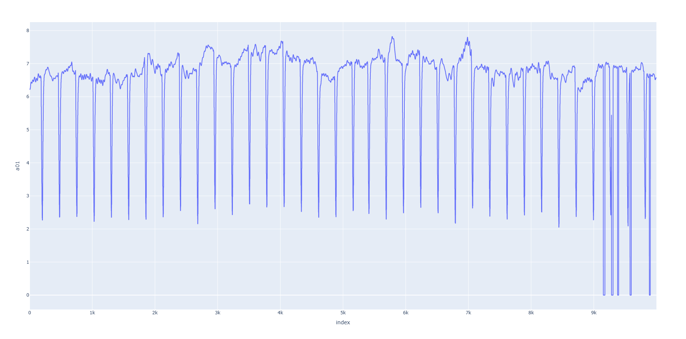
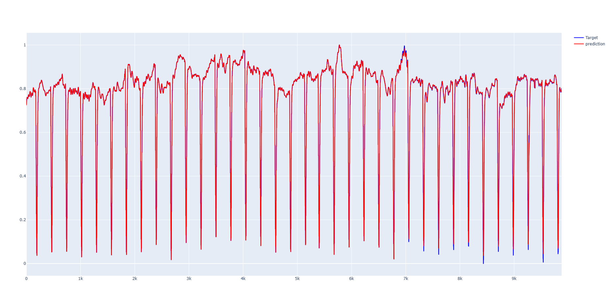
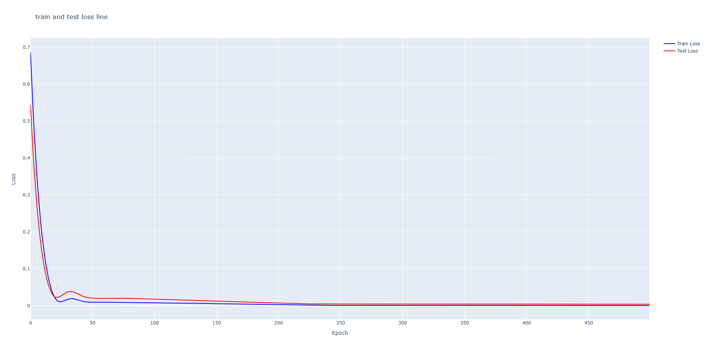
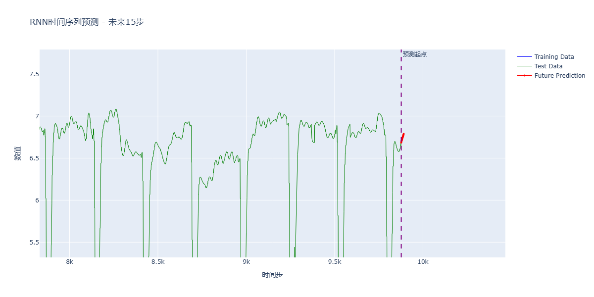

# DP(data prediction)
## 实现思路
首先我之前并没有做过相关的预测，作者之前做的是图像，因此实验会比较花费时间，但是本着对探索新事物的热情，想挑战一下。下面介绍实现思路。
### 思路1（不可行）：  
代码框架是基于DANets进行搭建的。这个项目是用来tabular regression，这是因为数据是连续的，而不是类别数据，因此这里采用表格回归，同时数据中不存在时间戳，所以也不是时间序列预测。  
- 问题  
但是数据集给出的是**全零行**，**特征**与**目标列**全部为*0*.  
回归是利用其他列的特征作为输入来预测某一列的输出，但是这里输入特征全是0，
因此不能采用这种方式，通过观察数据集发现，索引是按照步数1作为递增的，
因此采用时序进行预测，并且发现最后一列是分类目标，所以准备先进行时序预测，
之后采用分类。从而实现所有空白行的填补。    
### 思路2（不可行）：  
目前的想法更改为两阶段训练，首先进行时序预测，之后分类，预测出最后一列空白列。  
- 缺点  
误差传递，这种方式会导致阶段1的误差累积到阶段2中。最终我们选择方案2.  
**输入的特征过于简单，由于输入序列不是时间序列，因此很难去学习a01特征的变化规律，根据指标RMSE指标训练结果很高，说明模型的拟合效果很差**

### 思路3（可行）
深度学习模型最适合学习序列号与所有列值之间的复杂非线性趋势。模型如GRU
(门控循环单元)或LSTM（长短期记忆）  
- 输入X：在训练阶段，模型输入是前面的N歌时间步的所有列（a01,a02,....）
的历史值，以及序列号特征。  
- 输出Y：模型的输出是第N+1个时间步的所有列的预测值  
- 外推（预测空白行）：训练完成后，使用序列最后N个非零行作为输入，预测出第
N+1行的值，然后将这个预测值加入序列，再预测第N+2行的所有值，以此类推（自回归预测）
## 相关算法
- 机器学习
```shell script
XGBoost, LightGBM, SVR, KNN
``` 
- 深度学习
```shell script
RNN， LSTM， GRU, Transformer， GRU-D, BRITS
``` 
## 数据集特征
  
由图片可以看到这个数据是带有周期的。  
数据集中存在部分空白行，空白行如下：
```shell script
9154-9179, 9285-9309, 9381-9398, 9580-9599, 9888-9903
```
同时根据数据集要求，这里a01列作为目标值，除了id与a01列，其他列作为特征值。  
## 算法实现
- 硬件
```shell script
RTX 1080Ti
```
- 安装依赖  
```shell script
pip install requirements.txt
```
- XGBoost时序预测  
算法原理利用树训练不断对错误（残差）进行纠正。
这里未来预测只能使用序列号作为输入，利用序列号进行外推。
利用Xgboost预测的结果，这里采用序列号进行外推，发现序列特征过于简单，并且模型很难从单调递增的id中学习a01的变化规律
```shell script
python train_xgb_v4.py
```
训练发现结果很差，这是因为序列作为模型输入不能学习a01列的规律，因此此方法不可行。

- 自回归模型预测
这里我们利用前N行数据去预测未来数据，可以实现未来数据的预测。
训练和预测：
```shell script
python train.py --data_path "data/data_to_predict.csv" --epochs 500
```
- 训练结果：  
  
可以看到数据训练的过程是收敛的。  
- loss曲线  
 
- 预测未来数据：  
  
最终的预测结果保存在了data/data_predict.csv中。
